# 发布模块（Release）进度确认

> 对照文档：`docs/产品需求文档.md`（重点核对 `6.2.5 发布`、`6.2.12 图片视频预览编辑器`）
> 核对范围：`src/routes/app/release`、`src/lib/modules/media-cover`、`src/lib/components/custom/shin-rich`、`src/lib/stores/release`
> 结论基于当前代码实现，不基于口头计划。最后更新：2026-05-06。

## 一、总览结论

- **核心可用**：发布页主链路可跑通（填写 → 保存/自动保存 → 确认发布 → 上传 → CreatePost）。
- **部分达成**：封面与发布后体验仅完成基础能力，和 PRD 的完整交互还有明显差距。
- **关键缺口**：
  1. **独立封面强制裁切**（❌，阻塞：图片视频预览编辑器）。
  2. **媒体缩略图「编辑」入口**（❌，阻塞：同上）。
  3. **发布后横幅通知 + 圆形状态栏 + 多任务叠加**（❌，阻塞：全局通知组件方案）。
  4. **编辑帖子模式**（❌，阻塞：帖子详情入口 + EditPost 流程）。
  5. **@ 用户现网补齐**（⚠️，阻塞：后端用户搜索接口）。
  6. **Webview 保活**（❌，阻塞：原生壳层/桥接，前端无法单独落地）。

### 依赖树状图

> 以下树状图将「部分实现」的模块拆分为二元叶子节点（只有 ✅ / ❌），虚线表示对外部模块的依赖。

```mermaid
flowchart TD
    classDef done fill:#dcfce7,stroke:#16a34a,stroke-width:1.5px
    classDef todo fill:#fee2e2,stroke:#dc2626,stroke-width:1.5px
    classDef ext fill:#dbeafe,stroke:#2563eb,stroke-width:1.5px
    classDef root fill:#f3f4f6,stroke:#4b5563,stroke-width:2px

    R(["📝 发布模块<br/>#12 小特"]):::root

    subgraph 封面 ["封面"]
        direction TB
        FC["✅ 比例切换/自动提取"]:::done
        FSC["❌ 选择图片+强制裁切"]:::todo
    end

    subgraph 媒体 ["媒体"]
        direction TB
        MF["✅ 文件选择≤20"]:::done
        MT["✅ 缩略图/首帧"]:::done
        MD["✅ 拖拽排序"]:::done
        MM1["✅ 菜单:设为封面/删除"]:::done
        MM2["❌ 菜单:编辑"]:::todo
        MP["❌ 预压缩"]:::todo
    end

    subgraph 正文 ["正文与分区"]
        direction TB
        BI["✅ 标题/正文输入"]:::done
        BM["✅ @提及交互"]:::done
        BU["❌ @现网补齐"]:::todo
        PS["✅ 分区选择(必填)"]:::done
    end

    subgraph 操作 ["操作区"]
        direction TB
        OR1["✅ 重置(新建)/保存/自动保存"]:::done
        OR2["❌ 重置(编辑恢复现网)"]:::todo
        OR3["✅ 发布+二次确认"]:::done
    end

    subgraph 兜底 ["意外兜底"]
        direction TB
        SG["✅ 路由拦截/关闭提示/自动保存"]:::done
    end

    subgraph 发布 ["发布以后"]
        direction TB
        SP1["✅ 上传流程/取消/断线重试"]:::done
        SP2["❌ 横幅通知/圆形状态栏/多任务"]:::todo
        SP3["❌ Webview保活"]:::todo
        SP4["❌ 跳转帖子详情"]:::todo
    end

    subgraph 编辑 ["编辑帖子复用"]
        direction TB
        SE1["❌ 编辑入口"]:::todo
        SE2["❌ 现网回填/EditPost"]:::todo
    end

    R --> 封面
    R --> 媒体
    R --> 正文
    R --> 操作
    R --> 兜底
    R --> 发布
    R --> 编辑

    EXT1(["🛠 图片视频预览编辑器<br/>#11 northwolf"]):::ext
    EXT2(["📄 帖子详情页<br/>#7 northwolf"]):::ext
    EXT3(["📱 Stack布局基建<br/>#10 ✅ 已完成"]):::done
    EXT4(["🔔 全局通知组件<br/>未指定 #22"]):::ext
    EXT5(["🔌 后端接口<br/>用户搜索 / EditPost 未指定"]):::ext

    FSC -.-> EXT1
    MM2 -.-> EXT1
    SP4 -.-> EXT2
    SE1 -.-> EXT2
    SP2 -.-> EXT4
    BU -.-> EXT5
    SE2 -.-> EXT5
```

---

## 二、按 PRD 条目确认

### 2.1 `6.2.5.1` 帖子内容编辑表单

| 需求条目                                                 | 当前状态    | 代码确认                                                                                                                                                                                   |
| -------------------------------------------------------- | ----------- | ------------------------------------------------------------------------------------------------------------------------------------------------------------------------------------------ |
| 封面比例 `1:1 / 4:3 / 3:4`                               | ⚠️ 部分实现 | `coverRatio` + `rotateCoverRatio` 已实现比例切换；**但 PRD 要求选择封面后「立即强制弹出图片视频预览编辑器」进行强制裁切，该流程完全未实现**。当前封面自动从媒体第1张提取，无独立封面选择。 |
| 未设封面时使用第 1 张图片/视频首帧；无媒体时正文生成封面 | ✅ 已实现   | `resolveCoverBlob` 已覆盖图片/视频首帧/文字封面三种来源策略。                                                                                                                              |
| 「只能选择 1 张图片作为封面 + 强制弹出编辑器裁切」       | ❌ 未实现   | **完全缺失**。当前没有「独立封面选择并强制裁切」流程；`ReleaseCoverPreview` 仅支持点击切换比例，无编辑器入口。                                                                             |
| 选择图片/视频最多 20 张                                  | ✅ 已实现   | `MAX_MEDIA_COUNT = 20`，超出时 toast 提示并截断。                                                                                                                                          |
| 标题最大 20 字                                           | ✅ 已实现   | `Input maxlength={20}` + 实时字数计数。                                                                                                                                                    |
| 正文最大 10000 字                                        | ✅ 已实现   | `ShinRichTextarea maxLength` 默认 10000。                                                                                                                                                  |
| `@` 用户：插入、popover、上下键、enter                   | ✅ 已实现   | `ShinRichTextarea` + `RichTextareaController` 完整支持。                                                                                                                                   |
| `@` 后按 QQ/昵称/备注查询                                | ✅ 已实现   | `filterUsersByQuery` 支持三维度匹配。                                                                                                                                                      |
| 优先关注列表，不足 20 人补现网用户                       | ⚠️ 部分实现 | **关注列表已接入**（`fetch-mention-users.ts` 调用 `userServiceListUserFollowings`）；**现网用户补充为空白占位**（代码第 71–74 行 TODO：「缺后端 API，暂留空」）。                          |
| 分区选择必填                                             | ✅ 已实现   | `selectedSection` 校验 + 发布前阻断。                                                                                                                                                      |
| 校验：封面/媒体/正文任一可提交                           | ⚠️ 部分实现 | 当前 `validateForm` 校验「标题/正文/媒体任一」，逻辑上等价（封面从媒体自动提取）；**但若未来实现独立封面选择，校验逻辑需同步调整**。                                                       |
| **媒体缩略图长按/右键操作菜单**                          | ⚠️ 部分实现 | `ReleaseMediaPicker` 已实现长按/右键弹出菜单，含「设为封面」「删除」；**但 PRD 6.2.12 第 4 点要求菜单含「编辑」选项，点击后全屏打开图片视频预览编辑器进行裁切——该选项完全缺失**。          |
| **媒体拖拽排序**                                         | ✅ 已实现   | `ReorderGrid` + `reorderMedia` 已完整接入，支持触摸延迟拖拽与鼠标拖拽，封面索引随重排自动修正。                                                                                            |

#### 2.1.1 封面与媒体编辑缺口详解

| 缺口                   | PRD 来源        | 当前状态      | 阻塞原因                                                                   | 负责人                                              | 预计工作量                             |
| ---------------------- | --------------- | ------------- | -------------------------------------------------------------------------- | --------------------------------------------------- | -------------------------------------- |
| 独立封面选择与强制裁切 | 6.2.5.1 第 1 点 | ❌ 完全未实现 | 依赖「图片视频预览编辑器」能力接入                                         | 前端：northwolf（编辑器，技术架构设计.md 第 11 项） | 中等（编辑器 API 对接 + 强制弹窗流程） |
| 媒体缩略图「编辑」选项 | 6.2.12 第 4 点  | ❌ 完全未实现 | 同上                                                                       | 同上                                                | 小（菜单加一项 + 调编辑器）            |
| 媒体预压缩             | 6.2.12 第 3 点  | ❌ 未实现     | 前端暂无图片预压缩逻辑；视频预压缩「在低端机上也能达到良好的用户体验」才做 | 技术架构设计.md 未指定                              | 中等（需调研压缩库 + 性能测试）        |

---

### 2.2 `6.2.5.2` 操作区

| 需求条目                          | 当前状态    | 代码确认                                                                                                                                                                                    |
| --------------------------------- | ----------- | ------------------------------------------------------------------------------------------------------------------------------------------------------------------------------------------- |
| 重置 + 二次确认                   | ⚠️ 部分实现 | 二次确认弹窗 ✅；**新建场景清空 ✅**；**编辑场景「恢复现网内容」❌——因为编辑模式整体未实现**（`+page.svelte:199` TODO）。                                                                   |
| 保存（无变更提示 / 有变更持久化） | ✅ 已实现   | `isDirty` + `saveReleaseDraft` + IndexedDB 完整链路。                                                                                                                                       |
| 每 1 分钟自动保存                 | ✅ 已实现   | `setInterval(..., 60000)`，`performSave(true)`。                                                                                                                                            |
| 「保存于 / 自动保存于 xx:xx」     | ⚠️ 部分实现 | 时间显示 ✅；**文案统一显示为「保存于」**（`release-action-bar.svelte:142` 两分支文案相同），注释说明是因低分辨率手机换行问题暂时简化。若需严格区分「保存于」与「自动保存于」，需单独处理。 |
| 发布帖子 + 二次确认               | ✅ 已实现   | `showPublishConfirm` + `handleSubmit`，表单校验前置。                                                                                                                                       |

---

### 2.3 `6.2.5.3` 意外兜底

| 需求条目              | 当前状态  | 代码确认                                                   |
| --------------------- | --------- | ---------------------------------------------------------- |
| 路由跳转前二次确认    | ✅ 已实现 | `beforeNavigate` 拦截 + `showLeaveConfirm` 弹窗。          |
| 关闭标签页 / 刷新提醒 | ✅ 已实现 | `beforeunload` 事件监听，有脏数据时触发浏览器原生提示。    |
| 退出前自动保存        | ✅ 已实现 | `handleLeaveConfirm` 中先调用 `performSave(true)` 再导航。 |

---

### 2.4 `6.2.5.4` 发布以后

| 需求条目                             | 当前状态          | 代码确认                                                                                                                                                 |
| ------------------------------------ | ----------------- | -------------------------------------------------------------------------------------------------------------------------------------------------------- |
| 确认发布后才开始上传                 | ✅ 已实现         | `handleSubmit` → `upload.submit()` → Uppy 上传 → `completePublish`。                                                                                     |
| 上传进度可视化                       | ⚠️ 部分实现       | 底栏有进度条 +「上传中 x/y」+ Uppy `progress` 事件；**但 PRD 要求的「App 横幅通知」完全缺失**，当前仅用底栏替代（`release-action-bar.svelte:98` TODO）。 |
| 取消上传                             | ✅ 已实现         | `onCancelUpload` + `cancelAll` + 二次确认弹窗。                                                                                                          |
| 成功 / 失败提示                      | ✅ 已实现（基础） | toast 已有；发布成功、取消、部分失败、上传错误均有对应提示。                                                                                             |
| 上传横幅通知（含封面 / 状态 / 进度） | ❌ 未实现         | **完全缺失**。代码中仅有 TODO（`release-action-bar.svelte:98`）。                                                                                        |
| 隐藏横幅 → 右下圆形状态栏            | ❌ 未实现         | **完全缺失**。                                                                                                                                           |
| 多任务叠加展示                       | ❌ 未实现         | **完全缺失**。                                                                                                                                           |
| 断线失败后的重试 / 删除              | ✅ 已实现         | `handleRetryUpload` + `handleRemoveFailedAndProceed`，`retryAll` / `removeFile` 完整链路。                                                               |
| Webview 保活                         | ❌ 未实现         | **完全缺失**。`+page.svelte:16` 仅有 TODO；依赖原生桥接。                                                                                                |
| 发布成功跳转帖子详情                 | ⚠️ 部分实现       | 当前固定 `goto('/')`；`+page.svelte:98` TODO「等路由就绪后补充」。                                                                                       |

#### 2.4.1 发布后体验缺口详解

| 缺口                 | PRD 来源           | 当前状态      | 阻塞原因                                                       | 负责人                                               | 预计工作量                          |
| -------------------- | ------------------ | ------------- | -------------------------------------------------------------- | ---------------------------------------------------- | ----------------------------------- |
| 上传横幅通知         | 6.2.5.4 第 2 点    | ❌ 完全未实现 | 依赖全局通知组件方案；需设计独立于页面生命周期的上传任务管理器 | 技术架构设计.md 第 22 项未指定前端负责人             | 较大（任务队列 + 横幅 UI + 状态机） |
| 圆形状态栏           | 6.2.5.4 第 3、6 点 | ❌ 完全未实现 | 同上                                                           | 同上                                                 | 中等（圆形状态栏组件 + 与横幅联动） |
| 多任务叠加           | 6.2.5.4 第 4 点    | ❌ 完全未实现 | 同上                                                           | 同上                                                 | 中等（任务队列支持多并发）          |
| Webview 保活         | 6.2.5.4 第 9 点    | ❌ 完全未实现 | 依赖原生壳层 / JSBridge；前端无法单独落地                      | 技术架构设计.md 未指定原生负责人                     | 较大（需原生端配合 + 桥接协议设计） |
| 发布成功跳转帖子详情 | 6.2.5.4 第 8 点    | ⚠️ 部分实现   | 帖子详情路由未就绪                                             | 前端：northwolf（帖子详情，技术架构设计.md 第 7 项） | 小（路由就绪后改一行 `goto`）       |

---

### 2.5 `6.2.8.4` 编辑帖子复用发布页

| 需求条目                              | 当前状态  | 代码确认                                                                                                                |
| ------------------------------------- | --------- | ----------------------------------------------------------------------------------------------------------------------- |
| 进入编辑模式、回填现网、调用 EditPost | ❌ 未实现 | **完全缺失**。代码中无任何 `editMode` / `postId` / `EditPost` 相关逻辑；当前仅新建发布流程（`postServiceCreatePost`）。 |

#### 2.5.1 编辑模式缺口详解

| 缺口         | PRD 来源        | 当前状态      | 阻塞原因                                            | 负责人                                                                                   | 预计工作量                          |
| ------------ | --------------- | ------------- | --------------------------------------------------- | ---------------------------------------------------------------------------------------- | ----------------------------------- |
| 编辑帖子入口 | 6.2.8.4         | ❌ 完全未实现 | 帖子详情页未实现（由 northwolf 负责），无从进入编辑 | 前端：northwolf（帖子详情，技术架构设计.md 第 7 项）；release 域对接人未在架构文档中指定 | 大（需帖子详情先就绪）              |
| 现网内容回填 | 6.2.8.4         | ❌ 完全未实现 | 依赖 EditPost API + 帖子详情数据结构                | 后端：未指定；前端 release 域对接人未在架构文档中指定                                    | 中等（API 对接 + 草稿加载逻辑改造） |
| 重置恢复现网 | 6.2.5.2 第 1 点 | ❌ 完全未实现 | 编辑模式未实现，无从谈起                            | 前端 release 域对接人未在架构文档中指定                                                  | 小（编辑模式就绪后实现）            |

---

## 三、已确认的基建能力

| 模块               | 状态 | 说明                                                                                     |
| ------------------ | ---- | ---------------------------------------------------------------------------------------- |
| `release-media`    | ✅   | `File[] ↔ DraftMediaItem[]`，含 Live Photo 解析（`lp_<groupId>_image\|video.*` 命名）。 |
| `media-uploader`   | ✅   | Uppy + 分片上传能力已接入，`createMediaUploader` / `retryAll` / `cancelAll`。            |
| `release-draft`    | ✅   | IndexedDB 持久化、`schemaVersion` 迁移、默认值填充、`textCoverStyleId` 白名单校验。      |
| `media-cover`      | ✅   | 图片优先、视频首帧、文字封面统一决策；registry-based text-cover renderers。              |
| `ShinRichTextarea` | ✅   | 富文本输入、`@` 提及、内容提取、键盘导航（上下键 + Enter）。                             |
| `reorder-grid`     | ✅   | 触摸/鼠标拖拽排序，手势 arena 兼容，Android WebView 滚动复位。                           |
| `notify` 统一入口  | ✅   | `uploadError` / `operationError` 封装，release 域 toast 调用已全部迁移。                 |

---

## 四、阻塞与依赖

| 事项                                 | 依赖方                           | 当前情况                                                                           | 负责人                                                          |
| ------------------------------------ | -------------------------------- | ---------------------------------------------------------------------------------- | --------------------------------------------------------------- |
| 独立封面强制裁切 + 媒体「编辑」菜单  | 图片视频预览编辑器能力           | 编辑器组件未接入 release 域；编辑器本身由 northwolf 负责                           | 前端：northwolf（编辑器）→ release 域对接人待定                 |
| `@` 用户补足「现网用户」             | 后端用户搜索接口                 | 前端 `fetch-mention-users.ts` 已留空 TODO；需后端提供按 QQ/昵称/备注搜索用户的 API | 后端：未指定 → 前端对接人待定                                   |
| 发布后横幅 / 圆形状态栏 / 多任务叠加 | 全局通知组件方案                 | 尚未接入；需设计独立于页面生命周期的上传任务管理器                                 | 技术架构设计.md 第 22 项未指定前端负责人，待定                  |
| Webview 保活                         | 原生壳层 / JSBridge              | 前端无法单独落地；需 Android/iOS 端配合实现后台保活 + 桥接通知                     | 原生：Android/iOS（壳层）→ 前端对接人待定                       |
| 编辑帖子模式                         | 帖子详情入口 + EditPost 流程联调 | 帖子详情页由 northwolf 负责，尚未就绪；EditPost API 待后端确认                     | 前端：northwolf（帖子详情）+ release 域对接人待定；后端：待确认 |
| 发布成功跳转帖子详情                 | 帖子详情路由就绪                 | 当前 `goto('/')`；等帖子详情路由实现后改目标地址                                   | 前端：northwolf（帖子详情）                                     |

---

## 五、建议的下一步（按优先级）

### P1（阻塞其他模块或影响核心体验）

1. **接入图片视频预览编辑器**：实现「独立封面选择并强制裁切」+ 媒体缩略图菜单「编辑」选项。——**被编辑器组件阻塞，需 northwolf 先交付或提供可用 API**。
2. **补「编辑帖子模式」基础框架**：在 `+page.svelte` 中识别 `?edit=postId` 路由参数，进入编辑模式时调用 `GetPost` 回填现网内容，发布时调用 `EditPost`。——**被帖子详情页阻塞，需 northwolf 先交付帖子详情入口**。
3. **补「发布成功跳转帖子详情」**：等帖子详情路由就绪后，将 `goto('/')` 改为 `goto('/app/post/' + postId)`。——**同上，被帖子详情阻塞**。

### P2（体验提升，不阻塞主链路）

4. **实现发布后横幅通知 + 圆形状态栏**：设计全局上传任务管理器（独立于页面生命周期），支持多任务叠加、进度展示、隐藏/展开。——**技术架构设计.md 第 22 项未指定前端负责人；若该模块有独立负责人，应由其主导组件实现，release 域负责调用接入**。
5. **图片预压缩**：在 `handleFileSelect` 中接入图片压缩（如 `browser-image-compression`），限制上传前单张图片体积。——**技术架构设计.md 未指定负责人**。

### P3（依赖外部，等待就绪）

6. **等后端接口后补「现网用户」候选**：需后端提供用户搜索接口。——**被后端接口阻塞**。
7. **等原生桥接后补 Webview 保活**：需 Android/iOS 端提供后台任务保活能力。——**被原生壳层阻塞，前端无法单独落地**。

---

## 六、审校记录

| 日期       | 审校人 | 变更                                                                                                                                                                                                                                           |
| ---------- | ------ | ---------------------------------------------------------------------------------------------------------------------------------------------------------------------------------------------------------------------------------------------- |
| 2026-04-05 | 小特   | 初版                                                                                                                                                                                                                                           |
| 2026-05-06 | Claude | 严格审核：将「封面比例」从 ✅ 改为 ⚠️（缺强制裁切）；将「媒体操作菜单」从遗漏补为 ⚠️（缺「编辑」选项）；新增「发布后缺口详解」表格；新增「编辑模式缺口详解」表格；新增「封面与媒体编辑缺口详解」表格；重新评估所有阻塞项的负责人与预计工作量。 |
